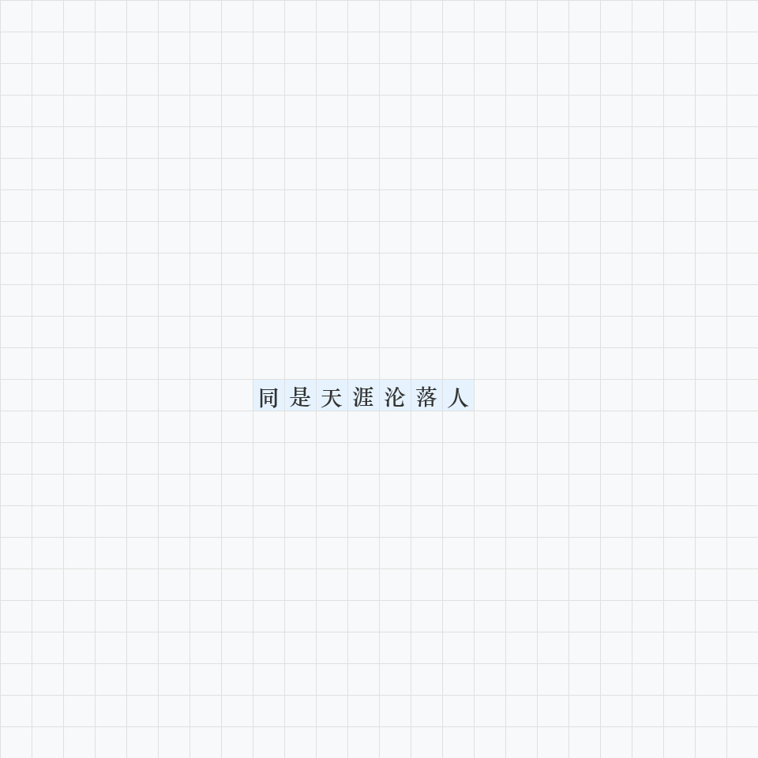

# AstrBot 诗词游戏引擎


AstrBot 诗词对战插件，内置庞大诗词数据库（119 万首），支持 **衔字飞花令** / **纵横飞花令** / **蛇形飞花令** 三种玩法，搭载 AI Bot 自动对战。

---

## 安装

### 1. 安装插件

AstrBot WebUI → 插件管理 → 输入仓库地址：
```
https://github.com/sfw2099/astrbot_plugin_poetry_games.git
```

### 2. 安装数据库

插件安装完成后，在任意群聊中发送：
```
/安装数据库
```

系统会自动探测多个下载源（Gitee 国内优先），选择最快的下载并自动解压安装。

```
🔍 正在探测下载源...
📡 下载源测速结果：
  1. 0.8s  95MB  Gitee 分片
  2. 2.1s  366MB  GitHub 直链
⬇️ 选用 Gitee 分片 (0.8s)，开始下载...
  [1/4] ✓ 95MB 累计 (12s)
  [2/4] ✓ 190MB 累计 (35s)
  [3/4] ✓ 285MB 累计 (47s)
  [4/4] ✓ 366MB 累计 (40s)
📦 正在解压...
✅ 数据库安装完成 (690 MB)
```

> **提示**：如服务器在海外，GitHub 直链通常最快。国内服务器 Gitee 源有显著优势。可在 WebUI 配置中自定义 `proxy_urls`。

---

## 游戏模式

### 🌸 衔字飞花令

经典飞花令玩法，玩家轮流接龙诗句。

```
/衔字飞花令         → 建立对局
加入                → 参与游戏
发送诗句            → 接龙（需含前两句各至少一字）
/bot加入            → AI Bot 加入对战
```

**得分规则**：匹配前两句的汉字数量越多，得分越高（2^n 指数增长）。被匹配过的字进入冷却（下家不可再用）。

---

### 🌟 纵横飞花令

在棋盘上通过诗句交叉占领领地，适合多人对战。

```
/纵横飞花令 [宽] [高]   → 建局（默认 24x24）
```



**玩法**：
1. 发送一句完整的古诗（至少 4 字），诗句必须与棋盘上已有的字产生交叉
2. 有多条合法路线时，回复数字选择落子位置
3. 占领格子最多的玩家获胜
4. 同一句诗不能重复使用

---

### 🐍 蛇形飞花令

贪吃蛇 + 诗词！在棋盘上通过诗句连接食物，扩张蛇身。

```
/蛇形飞花令 [宽] [高]    → 建局（默认 40x40）
```


**玩法**：
1. 发送含棋盘上食物字词的诗句，蛇身延伸覆盖食物
2. 吃到的食物越多，蛇身越长
3. 重叠已有诗句可获得额外积分
4. 蛇身有寿命限制（默认 3 轮），需持续"进食"维持

---

## AI Bot

发送 `/bot加入` 让 Bot 自动参与对战，支持衔字飞花令和纵横飞花令。

| 指令 | 说明 |
|------|------|
| `/bot加入` | Bot 加入当前游戏 |
| `/bot退出` | Bot 退出当前游戏 |

轮到 Bot 时会自动查数据库匹配最佳诗句，延迟 2-4 秒模拟思考，正常参与计分和淘汰。

> 蛇形飞花令暂不支持 Bot 参与。

---

## 全部指令

### 建局
| 指令 | 说明 |
|------|------|
| `/衔字飞花令` | 建立衔字飞花令对局 |
| `/纵横飞花令 [宽] [高]` | 建立纵横飞花令（默认 24x24） |
| `/蛇形飞花令 [宽] [高]` | 建立蛇形飞花令（默认 40x40） |

### 局内操作
| 指令 | 说明 |
|------|------|
| `加入` / `退出` | 参与或退出当前游戏 |
| `跳过` / `催更` | 跳过长考中的玩家 |
| `/bot加入` / `/bot退出` | AI Bot 管理 |

### 管理
| 指令 | 说明 |
|------|------|
| `/结束游戏` | 立即结束并显示最终战报 |
| `/生成战报` | 查看当前排名和计分 |
| `/恢复游戏 [序号]` | 从存档恢复未完成的游戏 |
| `/删除存档 [序号]` | 永久删除指定存档 |
| `/飞花令帮助` | 查看完整帮助菜单 |

### 查询
| 指令 | 说明 |
|------|------|
| `/查询诗句 [内容]` | 精确 + 模糊搜索诗句出处 |
| `/查询诗词 [标题] [作者]` | 按标题/作者检索完整诗词 |

---

## 配置

在 AstrBot WebUI 插件配置面板中可调整：

| 配置项 | 类型 | 默认 | 说明 |
|--------|------|------|------|
| `flowing_timeout` | int | 60 | 衔字飞花令每回限时（秒） |
| `crossword_timeout` | int | 90 | 纵横飞花令每回限时（秒） |
| `snake_timeout` | int | 120 | 蛇形飞花令每回限时（秒） |
| `proxy_urls` | text | (内置列表) | 数据库下载地址，一行一个 |

---

## 数据来源

数据库基于 [poetry-dataset](https://github.com/sfw2099/poetry-dataset) 构建，整合自：

- [chinese-poetry](https://github.com/chinese-poetry/chinese-poetry) — 最全中华古诗词数据库
- [Werneror/Poetry](https://github.com/Werneror/Poetry) — 唐代至近现代诗词库
- [poetic-mao](https://github.com/cdn0x12/poetic-mao) — 毛泽东诗词集

共 **1,197,883 首**诗词，覆盖先秦至近现代，支持简体中文 FTS5 全文检索。

---

## License

AGPL-3.0
